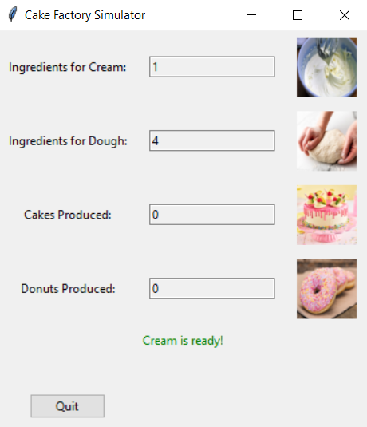

# Cake Factory Simulator

## Project Description
The Cake Factory Simulator is a graphical application that simulates a factory producing cakes and donuts. The application is built using Python and Tkinter, and it involves multithreading to handle various tasks like earning ingredients, preparing cream and dough, and baking cakes and donuts.



## Concept Graphic
The graphic above represents the basic idea of the Cake Factory Simulator. The factory consists of different sections: one for earning ingredients for cream, another for dough, and sections for preparing the cream and dough. Finally, there are sections for baking cakes and donuts.

## Threads
The application uses six threads, each representing different parts of the cake and donut production process:

1. **earn_ingredients_for_cream**: This thread simulates earning ingredients for the cream by incrementing the cream ingredients counter at random intervals.
2. **earn_ingredients_for_dough**: This thread simulates earning ingredients for the dough by incrementing the dough ingredients counter at random intervals.
3. **prepare_cream**: This thread prepares the cream when enough ingredients are available by decrementing the cream ingredients counter and setting the cream readiness flag.
4. **prepare_dough**: This thread prepares the dough when enough ingredients are available by decrementing the dough ingredients counter and setting the dough readiness flag.
5. **bake_cake**: This thread bakes a cake when both cream and dough are ready by resetting the readiness flags and incrementing the cake counter.
6. **bake_donut**: This thread bakes a donut when both cream and dough are ready by resetting the readiness flags and incrementing the donut counter.

## Critical Sections
The application employs a mutex (Lock) to handle critical sections where shared resources are accessed and modified. The critical sections include:

1. **Updating Ingredients Counters**: Both cream and dough ingredients counters are updated within a locked section to prevent race conditions.
2. **Preparing Cream and Dough**: The preparation of cream and dough involves checking and updating the ingredients counters, which is done within a locked section.
3. **Baking Cakes and Donuts**: The baking process involves checking the readiness of cream and dough and updating the counters and readiness flags within a locked section.

These critical sections ensure that the shared resources are accessed safely and consistently across multiple threads.

## Requirements
- Python 3.x
- Tkinter library
- Pillow library for image handling

## How to Run
1. Ensure you have the required libraries installed:
   ```sh
   pip install pillow
Place the image files (cream_image.jpg, dough_image.jpg, cake_image.jpg, donut_image.png) in the same directory as the script.
Run the script:
sh
Skopiuj kod
python cake_factory_simulator.py